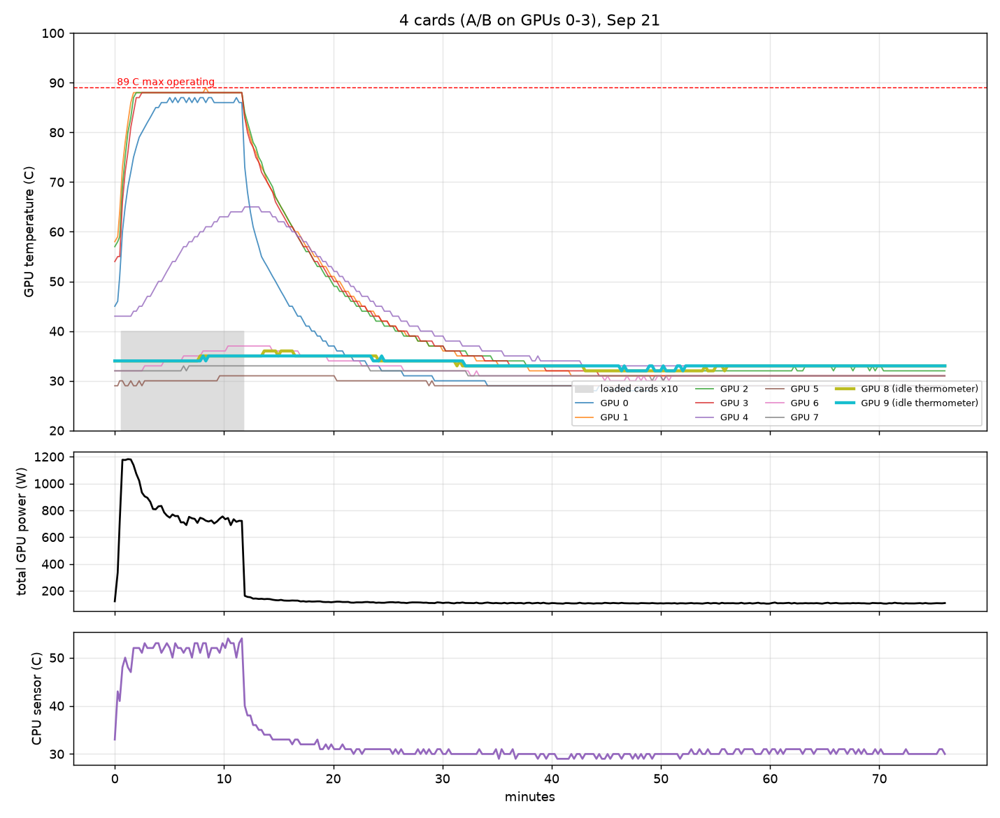
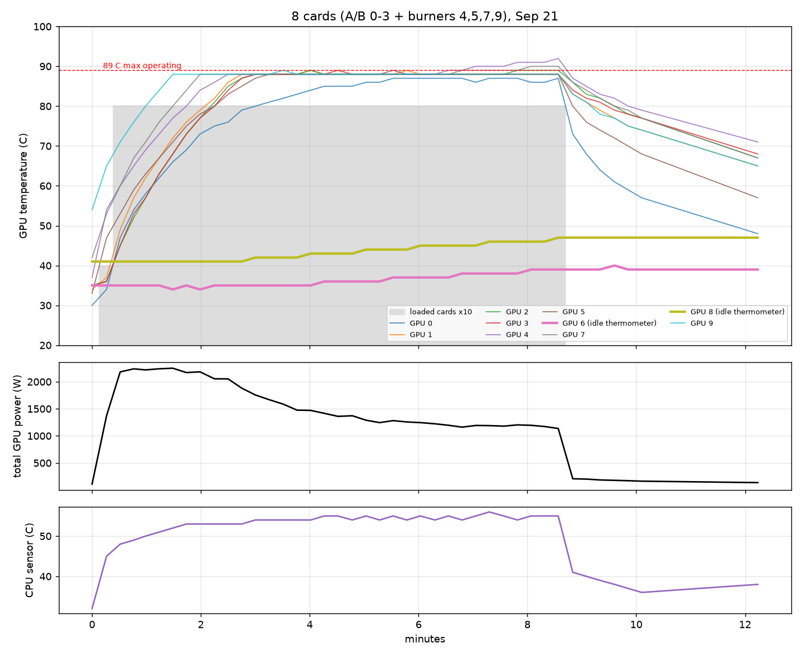

# Lambda server thermal findings

Measured on 2026-09-21 on lambda.ccm.edu (10x NVIDIA TITAN RTX, driver 470 / CUDA 11.4) by
sampling `nvidia-smi` every 1 to 5 seconds while running controlled loads. Logs, scripts and plots
are in `lambda_thermal_scripts_and_logs.zip` (sent to Prof. Rywalt on 2026-09-22). Written up
2026-09-25 for IS after the burning-smell incident.

## 1. Each card alone, 75 seconds at full load, everything else idle (18:05 to 18:29)

| card | start | reached 80 C after | max | clocks at the end | power | hardware slowdown | verdict |
|---|---|---|---|---|---|---|---|
| 0 | 28 C | never | 70 C | 1424 MHz | 278 W | none | ok |
| 1 | 30 C | never | 75 C | 1409 MHz | 280 W | none | ok |
| 2 | 36 C | never | 76 C | 1413 MHz | 279 W | none | ok |
| 3 | 33 C | never | 74 C | 1405 MHz | 278 W | none | ok |
| 4 | 38 C | 69 s | 81 C | 1386 MHz | 278 W | none | ok, warmer slot |
| 5 | 30 C | never | 72 C | 1424 MHz | 279 W | none | ok |
| 6 | 32 C | **10 s** | **88 C** | **902 MHz** | 208 W | after 21 s | **defective cooling** |
| 7 | 36 C | never | 78 C | 1406 MHz | 279 W | none | ok |
| 8 | 33 C | **11 s** | **88 C** | halved | ~208 W | after 23 s | **defective cooling** |
| 9 | 33 C | 68 s | 82 C | full | 280 W | none | ok, warmer slot |

Cards 6 and 8 go from idle to 88 C in about ten seconds under a load every other card carries
at 70 to 82 C, and the hardware then halves their clocks. That is what a dead fan or a failed
thermal pad looks like; it is not something a job can cause or fix.

## 2. Four adjacent cards loaded for 76 minutes (14:00 to 15:16, cards 0 to 3)

- Loaded cards: max 87 to 89 C, with the driver's own throttle flag set on the hot ones.
- Every idle card stayed at 29 to 37 C; the CPU stayed between 29 and 54 C.
- The idle "thermometer" cards rose by about 1 C over the run.

## 3. Eight cards loaded (18:32 to 18:44)

- Card 4 reached 92 C after 8.5 minutes and our watchdog killed the load.
- Loaded cards sat at 87 to 92 C; the idle cards 6 and 8 reached 40 to 47 C; CPU 32 to 56 C.

## What this says

- **The room absorbs the heat; the chassis does not move enough air across loaded cards.** Idle
  cards and the CPU stay cool even with eight cards loaded, while every loaded card climbs to the
  driver's throttle point (the driver reports its own limits as slowdown at 91 C and shutdown at
  94 C). Interior slots run hotter than edge slots.
- **Two cards (6 and 8) have failed cooling** and should not be used until serviced.
- A ten-GPU server is built to run all ten flat out; four cards at full load is well inside
  its design. That it runs this hot at four points at the cooling, not at the size of the job.
- What none of this can see: chassis, power-supply or room temperature, or a smell. Only IS
  can see those, and after the 2026-09-25 incident we treat any signal from IS as final.

## What the training did about it

- Used only four non-adjacent cards (0, 4, 5, 9), never 6 or 8, never all ten.
- Ran a watchdog that pauses the job at 92 C on any card, on any hardware slowdown, or when the
  idle cards or the CPU warm by more than 8 C above their baseline, and logs every event.
- Since 2026-09-25 the job also has an off switch IS can use (`touch ~/MaxGPT/HOLD` stops every
  start and restart), an allowed-hours window, and a duty cycle (for example 60% run / 40% idle
  per step, roughly 40% less average power and heat), so any limit IS sets can be met exactly.

## What would help, in order

1. **Service the cooling on cards 6 and 8** (fans or thermal pads) and check the chassis fans
   and dust filters: the two failed cards suggest the airflow problem is not new.
2. **A per-card power cap**, `nvidia-smi -pl 200` (needs root), which removes most of the
   throttling at about 80 to 85% of the speed and roughly 30% less heat per card. Users cannot
   set it.
3. **An ambient or inlet temperature reading users can see** (an IPMI sensor or a cheap probe),
   so a job can watch the number IS watches and stop itself on it.
4. If the server has to stay where it is, an agreed envelope: which cards, a duty cycle, or
   hours. All three are supported now and can be checked in the logs.

## Files

- `logs/brake_probe_per_card_1s.csv`: test 1, one sample per second, all ten cards.
- `logs/thermal_4cards_level1.csv`, `logs/thermal_8cards_level3.csv`: tests 2 and 3.
- `logs/watchdog_events.log`: every watchdog start, baseline and trip with its reason.
- `lambda_thermal/lambda_4cards_temperatures.png`, `lambda_thermal/lambda_8cards_temperatures.png`.
- `scripts/`: the probe, the watchdog and the plotting code (also on GitHub, MaxwellBrohm/MaxGPT).
